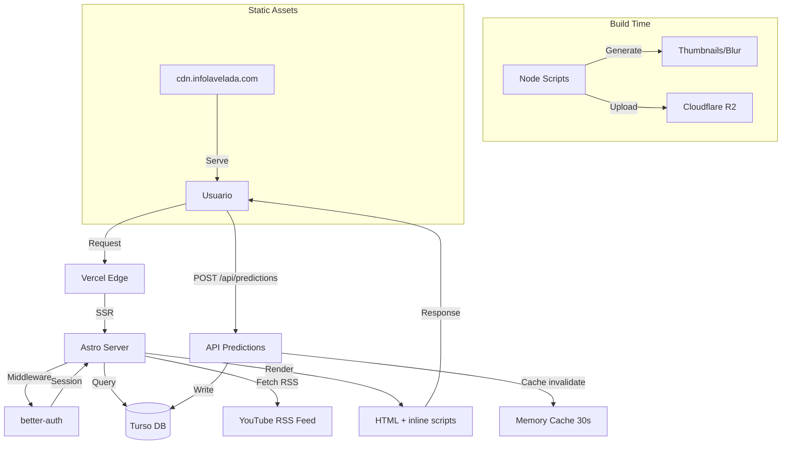

# Architecture — La Velada del Año VI

## Summary

Web oficial de La Velada del Año VI, un evento de boxeo entre streamers y creadores de contenido. Construida con Astro 6 en modo SSR con islands architecture, desplegada en Vercel. La arquitectura se define por tres decisiones clave: renderizado híbrido (páginas estáticas + dinámicas para pronósticos/auth), zero JavaScript client-side por defecto (todo server-side excepto interacciones específicas), y Content Collections con Live Loader para contenido dinámico del canal de YouTube.

## Stack

- **Framework**: Astro 6.4.7
- **Output mode**: `server` (SSR con adapter de Vercel)
- **Language**: TypeScript (estricto)
- **Styling**: Tailwind CSS 4.3.0 + `@tailwindcss/vite` + `tailwind-animations`
- **Database**: Turso (LibSQL) para pronósticos de usuarios
- **Auth**: better-auth 1.6.15 (Twitch + Google OAuth)
- **Runtime**: Node.js (vía Vercel adapter)
- **Package manager**: pnpm 11.8.0

## Directory structure

```
src/
├── pages/              # Rutas file-based + API endpoints
│   ├── index.astro     # Home con secciones del evento
│   ├── boxeadores.astro # Lista de peleadores
│   ├── combates.astro  # Lista de combates
│   ├── pronosticos.astro # Sistema de predicciones
│   ├── artistas.astro  # Artistas del evento
│   ├── boxeadores/[id].astro # Página individual de boxeador
│   ├── combate/[id].astro # Página individual de combate
│   └── api/            # API endpoints SSR
│       ├── auth/[...all].ts # better-auth handler
│       └── predictions.ts # API de pronósticos
├── components/         # Componentes Astro reutilizables
│   ├── combat/         # Componentes específicos de combates
│   ├── Prediction*.astro # Sistema de predicciones (8 componentes)
│   ├── Boxer*.astro    # Componentes de boxeadores (6 componentes)
│   └── [otros].astro   # UI compartida
├── sections/           # Secciones grandes de páginas (9 archivos)
│   ├── Header.astro    # Navegación principal
│   ├── Hero.astro      # Hero de homepage
│   ├── Podcast.astro   # Sección de podcast (consume Content Collection)
│   └── [otros].astro   # FAQ, Map, Sponsors, etc.
├── layouts/
│   └── Layout.astro    # Layout base con SEO, Analytics, meta tags
├── consts/             # Data estática del evento (13 archivos)
│   ├── boxers.ts       # 44KB de data de boxeadores
│   ├── battles.ts      # Parejas de combates
│   ├── artists.ts      # Artistas participantes
│   └── [otros].ts      # Videos, FAQs, banners, predicciones
├── lib/                # Lógica de negocio (11 archivos)
│   ├── auth.ts         # Configuración better-auth
│   ├── database.ts     # Cliente Turso
│   ├── predictions.ts  # Lógica de predicciones con cache
│   ├── share-image.ts  # Generación de OG images dinámicas
│   └── dom-selector.ts # Utility wrapper sobre querySelector
├── utils/              # Utilidades (3 funciones de optimización de imágenes)
├── types/              # Tipos TypeScript (7 archivos .d.ts)
├── styles/
│   └── global.css      # Estilos globales Tailwind
├── assets/             # Imágenes, SVGs, banners
├── content.config.ts   # Content Collections (podcast via YouTube RSS)
└── middleware.ts       # Session middleware (better-auth)

scripts/                # Build scripts Node.js (10 archivos)
├── generate-thumbnails.mjs
├── generate-blur-placeholders.mjs
├── upload-to-r2.mjs    # Subida a Cloudflare R2
└── [db scripts].mjs    # Scripts de DB (migrate, init, check, test)

.agents/                # AI tooling (13 skills)
└── skills/             # Kiro CLI skills personalizados

public/                 # Assets estáticos
```

## Rendering / execution model

**Modo híbrido SSR + prerendering selectivo:**

- **Output**: `server` en `astro.config.mjs` — todas las rutas se renderizan on-demand por defecto
- **Adapter**: `@astrojs/vercel` 10.0.8 — despliega como Vercel Serverless Functions
- **Páginas prerenderizadas**: `combates.astro` y `404.astro` tienen rutas estáticas, el resto es SSR
- **Islands architecture**: Astro components sin directivas `client:*` — todo el HTML es server-side, JavaScript solo se envía cuando hay `<script>` tags en componentes específicos
- **Hidratación**: No usa React/Vue/Svelte en modo hidratado; la interactividad client-side se maneja con `<script>` tags inline en componentes Astro que ejecutan vanilla JS/TS tras el HTML renderizado
- **API Routes**: `/api/auth/[...all].ts` (catch-all para better-auth) y `/api/predictions.ts` (GET predictions con cache)

**Patrón de interactividad:**
Los componentes como `PredictionVoteController.astro` o `BoxerSelector.astro` renderizan HTML estático + un `<script>` tag que se ejecuta en el cliente, manipulando el DOM con la utility `$` y `$$` (wrappers sobre `querySelector`). No hay framework client-side, todo es JavaScript imperativo post-hydration.

## Routing / navigation

**File-based routing (Astro):**

- `/` → `pages/index.astro`
- `/boxeadores` → `pages/boxeadores.astro`
- `/boxeadores/[id]` → Dynamic route, genera páginas para cada boxeador
- `/combate/[id]` → Dynamic route, genera páginas para cada combate
- `/combates` → `pages/combates.astro` (prerendered)
- `/pronosticos` → `pages/pronosticos.astro` (SSR con auth check)
- `/artistas` → `pages/artistas.astro`
- `/api/auth/[...all]` → Catch-all para better-auth OAuth flows
- `/api/predictions` → Endpoint GET para obtener predicciones (cache de 30s)

**Redirects/Rewrites (Vercel):**
Configurados en `vercel.json`:
- Trailing slash redirect: `/(path)/` → `/(path)` (permanent)
- Rewrites históricos: `/2024/*` → `2024.infolavelada.com`, `/2025/*` → `2025.infolavelada.com`

**Navigation:**
No usa view transitions de Astro (a pesar de tener la feature disponible). Navegación tradicional de full page loads.

## Data flow & state

**No hay state management global** — no usa nanostores, Zustand, Redux, ni ninguna librería de estado. Todo el estado es:

1. **Server-side (session)**: 
   - `middleware.ts` inyecta `context.locals.user` y `context.locals.session` via better-auth
   - Componentes acceden a `Astro.locals.user` para checkear autenticación
   
2. **Data fetching**:
   - Datos estáticos: importados desde `src/consts/*.ts` (boxeadores, batallas, artistas)
   - Predicciones: `src/lib/predictions.ts` con cache en memoria (30s TTL), fetching desde Turso
   - Podcast: Content Collection con Live Loader que parsea el RSS de YouTube cada build/revalidación

3. **Client-side state** (ephemeral):
   - Componentes con `<script>` manejan estado DOM-local via closures/variables
   - `PredictionVoteController.astro`: lee config inicial desde un `<script type="application/json">`, luego maneja votos con fetch POST y actualiza UI
   - `BoxerSelector.astro`: estado de hover/selección manejado en event listeners

**Database queries:**
- Turso client (`@libsql/client`) con queries SQL directas, sin ORM
- Predictions API: `SELECT combat_id, fighter_id, SUM(votes) as votes FROM predictions GROUP BY combat_id, fighter_id`
- Cache de 30 segundos en memoria para reducir hits a DB

## Diagram



## Notable patterns

1. **Zero-JavaScript by default**: La mayoría de componentes no envían JS al cliente. Solo los que tienen interactividad explícita (`<script>` tags) cargan código.

2. **Inline script configuration**: Componentes como `PredictionVoteController` inyectan config via `<script type="application/json">` que luego leen desde otro `<script>` ejecutable — evita window globals.

3. **DOM selector abstraction**: `src/lib/dom-selector.ts` exporta `$` y `$$` wrappers sobre `querySelector`/`querySelectorAll` para seguir regla del proyecto (ver `AGENTS.md`: nunca usar `document.querySelector` directamente).

4. **Memory cache pattern**: `src/lib/predictions.ts` implementa un cache en memoria con TTL de 30s para reducir carga en DB — simple pero efectivo para datos que cambian poco.

5. **Content Collection Live Loader**: `content.config.ts` define un loader personalizado que parsea el XML del RSS de YouTube sin dependencias externas (regex-based parsing) — mantiene la data sincronizada en cada build.

6. **Structured data rich**: `pages/index.astro` inyecta JSON-LD extenso para SEO (SportsEvent, Person schemas para boxeadores) — 100+ líneas de structured data.

7. **Prebuild asset pipeline**: `scripts/` contiene 10 scripts de preparación (thumbnails, blur placeholders, upload a R2) que corren en `prebuild` — separa generación de assets del build de Astro.

8. **Session-aware prerendering**: `middleware.ts` detecta `context.isPrerendered` y skips session lookup para páginas estáticas — evita warnings de Astro sobre headers en rutas prerenderizadas.

## Things to question

1. **No client-side state library pero UI compleja**: Componentes como `BoxerSelector.astro` (66KB, 1700+ líneas) tienen lógica de interacción pesada en vanilla JS. Un signal library ligero (Preact signals, nanostores) simplificaría el código y haría el estado más predecible.

2. **Cache en memoria sin invalidación**: `predictions.ts` usa un cache global con TTL, pero si múltiples instancias serverless corren en Vercel, cada una tiene su cache. Podría causar inconsistencias de hasta 30s entre usuarios. Redis/Vercel KV sería más apropiado para cache distribuido.

3. **Regex XML parsing**: `content.config.ts` parsea RSS con regex en lugar de un parser XML. Funciona para este caso simple, pero es frágil si YouTube cambia el formato del feed.

4. **Build scripts con side effects**: `prebuild` corre scripts que suben a R2 — si falla la subida, el build continúa. No hay manejo de errores robusto ni rollback.

5. **No optimización de imágenes en runtime**: Las imágenes se optimizan en build time (scripts) y se suben a R2, pero no usa `astro:assets` para optimización on-demand. Si se agregan imágenes nuevas, hay que re-runear scripts manualmente.

6. **Componentes grandes sin split**: `BoxerSelector.astro` (66KB) y `pages/boxeadores.astro` (54KB) son monolitos. Dividirlos en subcomponentes mejoraría mantenibilidad.

7. **Auth sin API tipo-safe**: better-auth se usa directamente con `context.request.headers`, pero no hay types exportados para `context.locals`. TypeScript no valida que `user`/`session` existan.

8. **No hay tests**: 0 archivos de test. Para un sistema de predicciones con DB y auth, al menos debería haber tests de integración para API routes.
