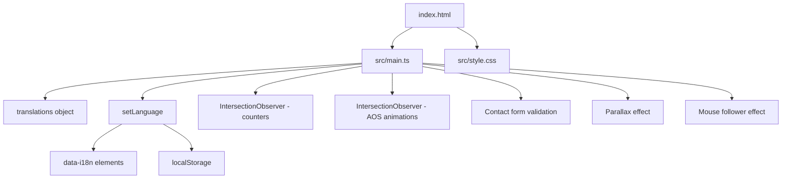

# Architecture — NovaTech Landing

## Summary

NovaTech Landing es una página de aterrizaje de una empresa de desarrollo de apps móviles enfocada en Latinoamérica. Está construida con Vite como herramienta de build y TypeScript vanilla (sin frameworks como React o Vue). La arquitectura es directa: un único archivo HTML con una única entrada TypeScript que maneja toda la interactividad, incluyendo un sistema de internacionalización (i18n) personalizado, animaciones basadas en IntersectionObserver, y un formulario de contacto con validación del lado del cliente.

Las decisiones arquitectónicas más definitorias son: (1) el uso de un patrón IIFE auto-ejecutado en `main.ts` para encapsular toda la lógica sin dependencias de framework, y (2) la implementación manual de i18n con atributos `data-i18n` en el HTML y un objeto de traducciones embebido en el JavaScript.

## Stack

| Componente | Tecnología | Versión |
|---|---|---|
| Build tool | Vite | 5.4.10 |
| Lenguaje | TypeScript | 5.6.3 |
| Runtime model | CSR puro (client-side rendering) | — |
| Estilos | CSS vanilla con custom properties | — |
| Framework UI | Ninguno (vanilla TS) | — |

TypeScript está configurado con `strict: false` y `moduleResolution: Bundler`, lo cual es apropiado para un proyecto Vite.

## Directory structure

```
novatech-landing/
├── index.html              # Entrada HTML, define toda la estructura de la página (396 líneas)
├── src/
│   ├── main.ts             # Lógica JS: i18n, navegación, animaciones, formulario (673 líneas)
│   ├── style.css           # Estilos completos con CSS variables y diseño responsive (1737 líneas)
│   ├── shared/             # Directorio vacío (sin uso actual)
│   └── __test__/           # Directorio de tests (sin contenido)
├── assets/                 # Recursos estáticos (imágenes, iconos)
├── dist/                   # Output de build (ignorado en .gitignore)
├── tsconfig.json           # Configuración TypeScript
├── package.json            # Dependencias y scripts
└── AGENTS.md               # Instrucciones para herramientas AI
```

## Rendering / execution model

**CSR puro (Client-Side Rendering)**. Vite sirve `index.html` tal cual durante desarrollo, y en build genera assets estáticos optimizados. No hay SSR, SSG, ni server-side de ningún tipo — todo el JavaScript se ejecuta en el navegador.

La página es una SPA (Single Page Application) de una sola vista, sin enrutamiento. La navegación se resuelve con scroll suave a secciones ancla (`#hero`, `#services`, `#about`, `#process`, `#contact`).

## Routing / navigation

No hay sistema de rutas. La página es un documento HTML único con secciones identificadas por IDs. La navegación funciona mediante:

1. **Anclaje con scroll suave**: links `a[href^="#"]` con `scroll-behavior: smooth` en CSS y un offset manual de 80px en JavaScript (`main.ts:377-393`).
2. **Navegación móvil**: hamburger toggle que muestra/oculta el menú con clase `.active`.

## Data flow & state

El estado de la aplicación es mínimo y efímero:

- **Idioma actual**: almacenado en `localStorage` bajo la clave `novatech-lang`, recuperado al cargar la página. Se almacena también en la variable `currentLang` dentro del IIFE.
- **Estado del formulario**: validación inline, mensajes de error/success transientes.
- **Estado del menú móvil**: clase CSS `.active` en `.nav-menu`.

No hay estado global compartido entre componentes, no hay store, ni gestión de estado compleja. El patrón es imperativo: funciones directas que mutan el DOM.

## Diagram



## Notable patterns

- **Sistema de i18n manual**: Los textos se almacenan como un objeto JavaScript anidado (`translations`) y se aplican al DOM mediante atributos `data-i18n` con notación de puntos (e.g., `data-i18n="hero.title.line1"`). Es una solución ligera para un sitio estático bilingual (ES/EN) sin necesidad de librerías externas.

- **Animaciones basadas en IntersectionObserver**: Las animaciones de entrada (AOS-like) y los contadores animados se activan cuando los elementos entran en el viewport, sin dependencias externas. El parallax y el mouse follower se desactivan si `prefers-reduced-motion: reduce` está activo — una práctica de accesibilidad correcta.

- **Validación de formulario accesible**: Los errores se muestran inline con `role="alert"`, se añade `aria-invalid` a los campos, y el foco se redirige al primer campo inválido. El estado del formulario usa `aria-live="polite"`.

- **CSS variables como design tokens**: Todo el sistema de colores, tipografía, espaciado y efectos está definido en `:root` con custom properties, facilitando la personalización global.

## Things to question

- **`src/shared/` vacío y `src/__test__/` vacío**: Estos directorios existen pero no contienen nada. Pueden ser restos de una plantilla inicial o planes no ejecutados. Si no hay intención de usarlos, se podrían eliminar para reducir confusión.

- **IIFE de 673 líneas**: `main.ts` contiene toda la lógica de la aplicación en un solo bloque IIFE. Para un sitio estático de una página funciona, pero si se necesita escalar (más animaciones, más interactividad, más idiomas), considerar modularizar en archivos separados (e.g., `i18n.ts`, `animations.ts`, `form.ts`).

- **Archivos duplicados**: `README copy.md` y `README copy 2.md` son copias de `README.md`. Deberían limpiarse.

- **Archivos CSS sin referencia**: `add.css` y `global.css` no están referenciados en `index.html`. Podrían ser obsoletos.
