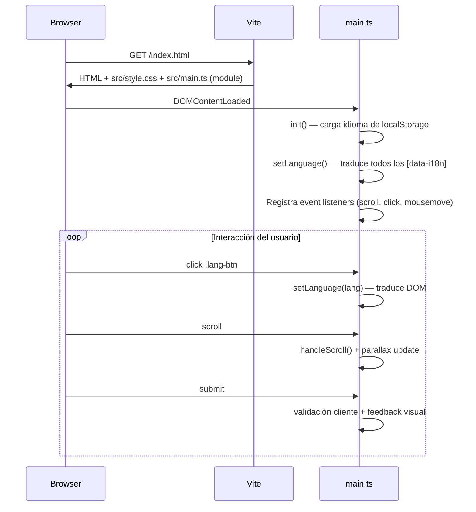

# Architecture — NovaTech Landing

## Summary

NovaTech Landing es una página web estática de una sola página que presenta los servicios de desarrollo de apps móviles de una empresa enfocada en Latinoamérica. Está construida con Vite como bundler sin meta-framework, utilizando TypeScript (con `strict: false`), CSS vanilla con custom properties y JavaScript vanilla envuelto en un IIFE. Las dos decisiones arquitectónicas más definitorias son: (1) soporte bilingüe EN/ES implementado con un sistema de traducciones propio (sin librería externa), y (2) un diseño visual rico con animaciones personalizadas (parallax, mouse follower, scroll-triggered) y un sistema de diseño glassmorphism sobre un tema oscuro.

## Stack

- **Bundler:** Vite 5.4.x (configuración por defecto, sin `vite.config.*`)
- **Lenguaje:** TypeScript 5.6.x (modo estricto deshabilitado)
- **Runtime:** Navegador (CSR puro — Client-Side Rendering)
- **Framework:** Ninguno — JavaScript vanilla
- **Estilos:** CSS vanilla con CSS custom properties (design tokens)

## Directory structure

```
.
├── index.html              # Entry point HTML (396 líneas), secciones: Hero, Services, About, Process, Contact, Footer
├── src/
│   ├── main.ts             # Lógica principal (673 líneas, IIFE): i18n, navegación, animaciones, formulario
│   ├── style.css           # Estilos completos (1737 líneas): design tokens, componentes, responsive
│   └── shared/             # Directorio vacío — sin uso actual
├── assets/
│   └── screenshot/         # Capturas de pantalla
├── dist/                   # Build output (ignorado por .gitignore)
├── .agents/skills/skrapi/  # Skill de análisis de arquitectura
├── .f1/                    # F1 My Memory — mapa de proyecto pre-generado
├── package.json            # Configuración del proyecto
├── tsconfig.json           # Configuración TypeScript
├── AGENTS.md               # Instrucciones para agentes de IA
└── add.css / global.css    # Archivos CSS no referenciados (candidatos a eliminación)
```

## Rendering / execution model

**CSR puro (Client-Side Rendering):** No hay SSR, SSG, ISR ni server-side de ningún tipo. Vite sirve el `index.html` estático durante desarrollo y genera assets estáticos para producción. Todo el contenido se renderiza en el navegador.

El script principal se carga como ES module (`<script type="module" src="/src/main.ts">`) y ejecuta toda la lógica dentro de un IIFE que se auto-ejecuta al cargar el DOM.

## Routing / navigation

**Sin router.** La navegación es por anclaje (`#hero`, `#services`, `#about`, `#process`, `#contact`) con smooth scroll implementado manualmente en `main.ts:377-393`. El offset de 80px compensa la barra de navegación fija.

## Data flow & state

El estado es mínimo y localizado:

- **Idioma actual:** Variable `currentLang` en el closure del IIFE, persistida en `localStorage` (`novatech-lang`). Se recupera al cargar la página.
- **Estado del formulario:** No persiste más allá de la sesión — se valida y resetea en cliente.
- **Scroll position:** Se usa solo para efectos visuales (navbar `scrolled`, parallax), no para lógica de negocio.

No hay estado global compartido entre componentes porque no hay componentes — es un monolito JS.

## Diagram



## Notable patterns

- **i18n propio sin librería:** Un diccionario de traducciones anidadas en JS (`translations`), con resolución por ruta de puntos (`data-i18n="hero.title.line1"`). Suficiente para un sitio estático, pero no escalaría bien a muchos idiomas o contenido dinámico.
- **Animaciones custom sin librería:** Sistema propio de scroll-triggered animations con `IntersectionObserver` (atributo `data-aos`), parallax con `requestAnimationFrame`, y mouse follower — todo respetando `prefers-reduced-motion`.
- **Validación de formulario accesible:** Muestra errores inline con `role="alert"`, gestiona `aria-invalid`, y hace focus al primer campo inválido. Sin backend — solo feedback visual.
- **Design tokens via CSS custom properties:** Colores, gradientes, tipografía, espaciado y efectos definidos en `:root` — permite theming potencial sin cambiar Selectores.
- **Accesibilidad decente:** Skip link, ARIA labels, `aria-expanded` en el toggle del menú, `aria-pressed` en botones de idioma, `prefers-reduced-motion` para desactivar animaciones.

## Things to question

- **`src/shared/` vacío:** Directorio creado pero sin contenido. Posible deuda técnica o plan abandonado.
- **Archivos no referenciados:** `add.css` y `global.css` no se usan en `index.html`. `README copy.md` y `README copy 2.md` son duplicados. Candidatos a limpieza.
- **TODO en el código:** Línea 455-456 de `main.ts` tiene un `// TODO: create a new function here` y un comentario `// % tis is a new commmit aqui` — parece un comentario de desarrollo temporal que se olvidó.
- **Sin linter ni formatter:** No hay ESLint, Prettier ni ningún tool de calidad configurado. No hay `lint` ni `format` script.
- **Sin tests:** No hay framework de testing, ni tests escritos, ni script `test`.
- **`strict: false` en tsconfig:** Deshabilita verificaciones de tipo estrictas. Para un landing page puede ser aceptable, pero oculta bugs potenciales.
- **Formulario sin backend:** El formulario solo valida y muestra feedback en cliente — no envía datos a ningún servidor. Si se necesita funcionalidad real, requiere integración con un servicio (EmailJS, Formspree, etc.).
