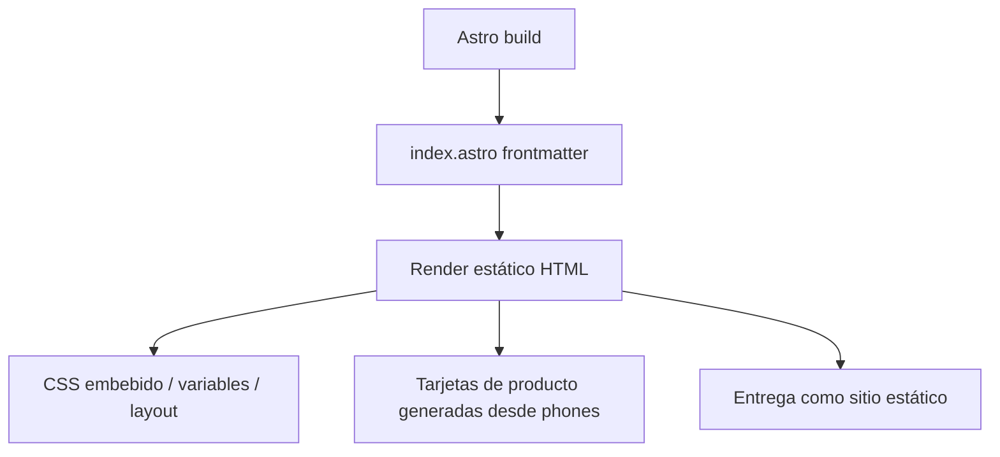

# Architecture — astro-test

## Resumen
Este proyecto es un sitio web Astro muy pequeño, centrado en una única página de catálogo con contenido definido en el propio archivo de la ruta. La arquitectura está dominada por una decisión: renderizar todo de forma estática y resolver la interfaz con HTML + CSS vanilla, sin componentes de cliente ni estado compartido. Los datos del escaparate viven en un arreglo local en el frontmatter y se transforman directamente en tarjetas de producto. En paralelo, el repositorio incluye varias skills de IA en `.agents/` y `.claude/`, pero eso no afecta al runtime de la app.

## Stack
Astro 6.3.6, TypeScript por configuración del proyecto, Node.js >=22.12.0. El modelo de ejecución es un sitio web estático generado por Astro, con estilos escritos en CSS embebido dentro del componente de página.

## Estructura de directorios
```text
/
├── astro.config.mjs — configuración mínima de Astro; no define adaptador ni modo de salida personalizado.
├── package.json — scripts de desarrollo/build y dependencias reales del proyecto.
├── public/ — activos estáticos servidos tal cual por Astro.
├── src/ — código de la aplicación.
│   └── pages/ — rutas basadas en archivos.
│       └── index.astro — única página visible; contiene los datos, el marcado y el estilo de la landing.
├── .agents/ — skills y reglas de agente usadas por el workspace; no forman parte del sitio en runtime.
└── .claude/ — skills de Claude Code y material de apoyo para agentes.
```

## Modelo de renderizado / ejecución
Astro usa su comportamiento por defecto, sin `output` ni adapter configurados, así que la página se compila a HTML estático en build time. No hay islas, directivas `client:*` ni componentes hidratados en la implementación actual. Todo el contenido visible se resuelve en el servidor de build y se entrega como archivos estáticos.

## Routing / navegación
El routing es file-based. `src/pages/index.astro` define la ruta raíz `/`. La navegación interna no usa router: el header apunta a anclas dentro de la misma página (`#shop`, `#about`) y el resto de la interacción es local.

## Flujo de datos y estado
El estado no sale del archivo de la página. El array `phones` en el frontmatter actúa como fuente de datos local y se mapea directamente a tarjetas. No hay fetch, caché, stores ni sincronización entre vistas; el botón de compra es sólo presentación.

## Diagrama


## Patrones notables
El proyecto usa datos declarativos en el frontmatter para evitar lógica dispersa en el markup. La UI se construye con CSS vanilla, variables personalizadas y clases reutilizables como `bento-card` y `btn`. También hay una dependencia visual fuerte de tipografía externa y de imágenes remotas para la presentación del catálogo.

## Cosas a cuestionar
Las imágenes de Unsplash se cargan desde terceros, así que el contenido depende de disponibilidad externa y de permisos de red. El botón "Add to cart" no tiene comportamiento, lo que deja la interfaz a medio camino entre demo visual y producto real. También conviene cuestionar si el uso de una sola página seguirá siendo suficiente cuando aparezcan detalles de producto, carrito o checkout.
