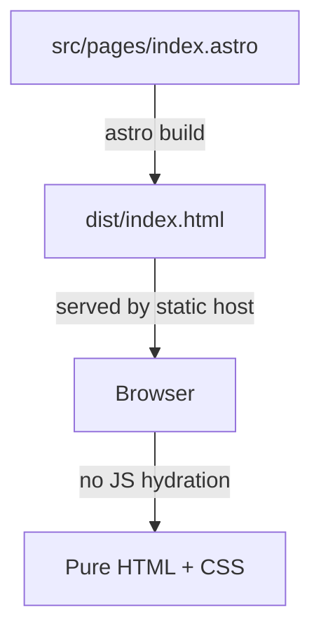

# Architecture — astro-test

## Summary
`astro-test` is a minimal static phone-store landing page built with Astro 6 and TypeScript. It renders a single page (`src/pages/index.astro`) with no framework integrations or server-side adapters, producing a fully static site. The defining architectural choice is pure Astro with no component islands — all interactivity is plain HTML/CSS, with zero client-side JavaScript.

## Stack
- **Framework**: Astro 6.3.x
- **Language**: TypeScript (strict mode via `astro/tsconfigs/strict`)
- **Runtime/Rendering**: Static (SSG) — default `output: 'static'`, no adapter configured
- **Package manager**: Bun (`bun.lock` present)

## Directory structure
```
astro-test/
├── src/
│   └── pages/
│       └── index.astro      # The only page; renders the full storefront UI
├── public/
│   ├── favicon.svg          # Vector favicon
│   └── favicon.ico          # Legacy favicon
├── .astro/
│   └── types.d.ts           # Generated Astro type declarations
├── .agents/skills/          # AI tool skills (Kiro / agent tooling)
├── .claude/skills/          # AI tool skills (Claude tooling)
├── astro.config.mjs         # Minimal Astro config — no plugins, no adapter
├── tsconfig.json            # Extends astro/tsconfigs/strict
├── package.json             # Two runtime deps: astro + fixnow
└── skills-lock.json         # Maps installed skill names to their source repos
```

## Rendering / execution model
Astro defaults to `output: 'static'` when no adapter is set. Every `.astro` file in `src/pages/` becomes a static HTML file at build time. There are no `client:*` directives in use anywhere — no islands, no hydration, no client JS bundle. The page is delivered as fully pre-rendered HTML.

## Routing / navigation
File-based routing: `src/pages/index.astro` → `/`. There is only one route. In-page navigation uses anchor links (`#shop`, `#about`).

## Data flow & state
All data is co-located in `index.astro`'s frontmatter as a static JS array (`phones[]`). There is no external data fetching, no API calls, no state management, and no dynamic data. `fixnow` is listed as a dependency but is not imported anywhere in the source page.

## Diagram


## Notable patterns
- **CSS custom properties as a design token system** — all spacing, color, radius, and typography values are declared as `--variables` in `:root` and consumed throughout, making theming straightforward.
- **Responsive bento grid with plain CSS Grid** — no utility framework needed; three breakpoints (1 → 2 → 3 columns) handled in ~10 lines.
- **Accessibility-aware interactions** — `:focus-visible` is handled alongside `:hover` on interactive elements.

## Things to question
- **`fixnow` is in `dependencies` but never imported** — it's a spell-checker / text-correction library. Either it was added speculatively, or it belongs in `devDependencies`. Either way, it ships in the dependency graph without contributing anything to the actual output.
- **No adapter defined** — fine for a demo, but means you can't add any server-side features (API routes, SSR pages) later without revisiting the config.
- **Single-page, single-array data model** — works at this scale; would not survive a real catalog. Worth noting if this project is ever meant to grow.
