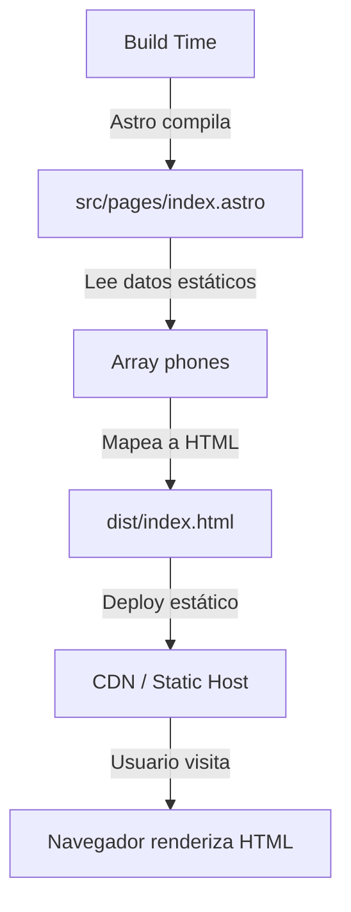

# Arquitectura — astro-test

## Resumen
Proyecto web minimalista construido con Astro v6 y TypeScript, generando una landing page estática de comercio electrónico con un diseño bento. La arquitectura es completamente estática (SSG) sin servidor backend ni adaptador especial, con estilos CSS en el mismo archivo del componente usando variables CSS personalizadas.

## Stack
- **Framework**: Astro ^6.3.6 con exportación estática
- **Lenguaje**: TypeScript (configuración estricta), módulos ES
- **Runtime**: Node.js >=22.12.0
- **Package manager**: Bun (detectado por `bun.lock`)
- **Tooling**: Vite (bundler incluido en Astro)

## Estructura de directorios
```
/
├── src/
│   └── pages/
│       └── index.astro        # Página principal con productos estáticos
├── public/                    # Assets estáticos (favicon.svg, favicon.ico)
├── .agents/skills/            # Skills para AI tooling (4 instalados)
├── .claude/skills/            # Skills para Claude (2 instalados)
├── astro.config.mjs           # Config mínima de Astro (sin adapter)
├── tsconfig.json              # Extiende astro/tsconfigs/strict
├── package.json               # Solo 2 dependencias: astro y fixnow
├── bun.lock                   # Lockfile del package manager
└── skills-lock.json           # Mapa de skills instalados con fuentes
```

**src/pages/**: Archivo único `index.astro` que contiene HTML, lógica JS en frontmatter y CSS scoped. No hay componentes separados, todo está inline.

**public/**: Favicons únicamente.

**.agents/skills/** y **.claude/skills/**: Skills para herramientas de AI — skrapi (análisis de arquitectura), auth0-quickstart, bun, gpt-image-2, improve-codebase-architecture, vercel-react-best-practices.

## Modelo de renderizado / ejecución
**Generación estática completa (SSG)**. Sin `output` configurado en `astro.config.mjs` significa que Astro usa el valor predeterminado `'static'`. No hay adaptador (`@astrojs/node`, `@astrojs/vercel`, etc.), por lo que el build genera HTML/CSS/JS completamente estático en `/dist`.

No hay islas, no hay directivas `client:*`, no hay hidratación — es HTML puro con CSS y lógica de render en build-time únicamente.

## Routing / navegación
Routing basado en archivos. `src/pages/index.astro` → `/` (página principal).

Navegación interna vía hash (`#shop`, `#about`) sin enrutamiento real — todo está en una sola página.

## Flujo de datos y estado
**Sin estado client-side**. Los datos de productos (`phones`) están hardcodeados en el frontmatter del archivo `.astro` como un array estático. No hay fetch, no hay API, no hay base de datos.

El único "flujo" es renderizado en build-time: el array `phones` se mapea a HTML durante la compilación de Astro.

## Diagrama


## Patrones destacables
- **CSS Variables puras**: Sistema de diseño completo con custom properties (spacing scale, colores, tipografía) sin framework CSS.
- **Scoped styles inline**: Todo el CSS vive en el mismo `.astro`, aprovechando el scope automático de Astro.
- **Single-file component**: HTML + datos + estilos en un solo archivo — simplicidad extrema para un sitio de una página.
- **Responsive grid nativo**: Usa CSS Grid con media queries directas en lugar de abstracciones (Tailwind, etc.).
- **Lazy loading de imágenes**: `loading="lazy"` en todas las imágenes de productos.

## Aspectos cuestionables
- **Datos hardcodeados**: El array `phones` debería idealmente venir de un archivo JSON separado o de Content Collections de Astro para facilitar mantenimiento.
- **Sin componentes reutilizables**: La card de producto está duplicada en el template (vía `.map()`), pero el markup completo está inline — extraer un componente `<ProductCard />` mejoraría la separación de responsabilidades.
- **Dependencia `fixnow` sin uso detectado**: Está en `package.json` pero no se importa en ningún archivo de `src/` — posible dependencia huérfana o planeada para futuro uso.
- **Sin optimización de imágenes**: Las URLs de Unsplash se cargan directamente sin pasar por el servicio de imágenes de Astro (`@astrojs/image` o el soporte de imágenes integrado) — se pierde optimización automática de formatos y tamaños.
- **Skills sin documentación activa**: Hay 6 skills instalados (algunos para tecnologías no usadas en el proyecto como Auth0, React best practices) pero sin un `SKILLS.md` raíz que explique por qué están ahí o cómo usarlos.
