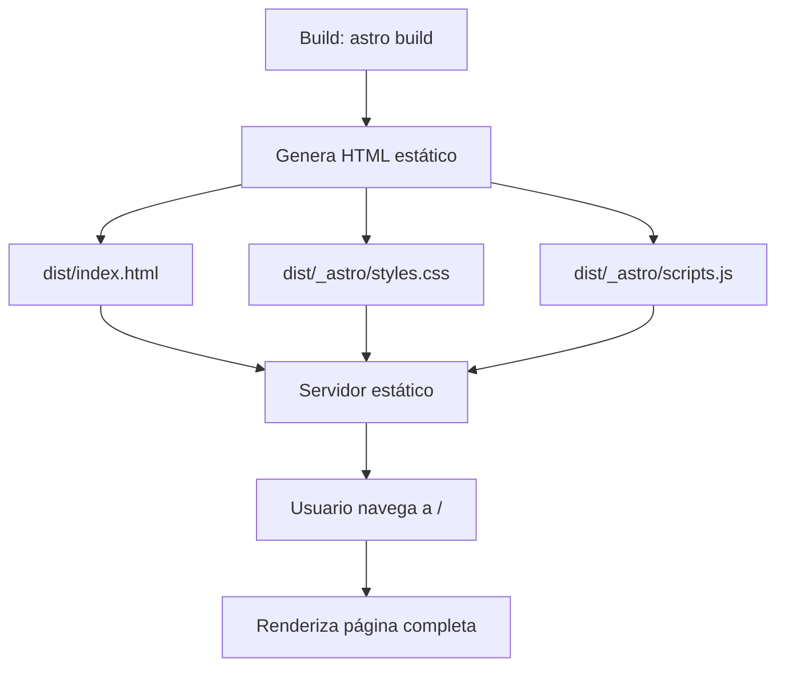

# Arquitectura — astro-test

## Resumen
Un sitio web estático minimalista construido con Astro, diseñado como tienda de móviles ficticia ("Soft Bento"). Utiliza arquitectura de islands de Astro pero sin componentes interactivos activos — todo el contenido se renderiza estáticamente. El sitio emplea CSS vanilla con custom properties para un diseño bento/grid responsive, sin frameworks CSS externos.

## Stack
- **Framework**: Astro 6.3.6 (renderizado estático)
- **Lenguaje**: TypeScript (configuración estricta)
- **Runtime**: Node.js ≥22.12.0
- **Modo de renderizado**: SSG (Static Site Generation) — modo por defecto de Astro, sin adaptador configurado

## Estructura de directorios
```
astro-test/
├── src/
│   └── pages/
│       └── index.astro    # Única página — contiene datos, plantilla y estilos
├── public/
│   ├── favicon.ico         # Favicon ICO
│   └── favicon.svg         # Favicon SVG
├── .agents/skills/         # Skills de agentes AI (4 skills)
├── .claude/skills/         # Skills específicos de Claude Code (2 skills)
├── astro.config.mjs        # Configuración de Astro (vacía/minimal)
├── tsconfig.json           # TypeScript estricto
├── package.json            # Dependencias
└── AGENTS.md               # Instrucciones para agentes AI
```

## Modelo de renderizado/ejecución
**SSG puro**: Astro genera HTML estático en tiempo de build. No hay adaptador configurado (ni Vercel, Netlify, ni Node server), lo que implica que `dist/` contiene archivos HTML/CSS/JS estáticos listos para servir.

No se utilizan componentes frameworks (React, Vue, Svelte) — todo el contenido está en archivos `.astro` nativos. El frontmatter de `index.astro` contiene datos hardcodeados (array de productos) que se renderizan directamente en el template.

## Enrutamiento
Enrutamiento basado en archivos de Astro. Actualmente solo existe una ruta:
- `/` → `src/pages/index.astro`

No hay middleware, rutas dinámicas ni endpoints API.

## Enfoque de estilos
CSS vanilla con **custom properties** (variables CSS) para un sistema de diseño tokenizado:
- **Tokens**: colores (`--primary`, `--surface`, `--text`), espaciado (`--spacing-xs` a `--spacing-section`), bordes (`--radius-sm` a `--radius-lg`)
- **Layout**: CSS Grid responsive con breakpoints en 600px y 900px
- **Patrón**: Bento grid — diseño de tarjetas en cuadrícula con transiciones hover suaves
- **Tipografía**: Fuente Google Fonts "Lora" (serif), cargada vía preconnect

No se usa Tailwind, CSS Modules, ni preprocessores — CSS scopes a nivel de componente via Astro.

## Flujo de datos y estado
**Sin estado dinámico**: Los datos de productos están hardcodeados en el frontmatter de `index.astro` como un array de objetos. No hay fetch de datos, APIs, ni almacenamiento persistente. El botón "Add to cart" es visual sin funcionalidad real.

## Diagrama


## Patrones notables
- **CSS tokenizado manual**: Sistema de diseño coherente sin herramientas externas, usando custom properties en `:root`
- **Responsive sin framework**: Grid adapta columnas (1→2→3) según breakpoints, con hero responsive también
- **Microinteracciones CSS**: Transiciones suaves en hover para cards y botones (180ms ease)
- **Imágenes lazy loading**: Atributo `loading="lazy"` en imágenes de productos

## Puntos a cuestionar
- **`fixnow` no se usa**: Dependencia instalada (spell checker multilingüe) pero no importada en ningún archivo del proyecto. Es dead weight.
- **`package2.json`**: Archivo package.json alternativo con nombre "la-velada-del-ano-v-web-oficial" y dependencias completamente diferentes (React, Tailwind, Vercel, better-auth, etc.). Parece un archivo de referencia o copia de otro proyecto — no se usa en el build actual.
- **Sin adaptador de despliegue**: No hay configuración de adaptador (Vercel, Netlify, etc.), lo que limita el despliegue a servir archivos estáticos manualmente.
- **Contenido hardcodeado**: Los datos de productos están inline en el componente — no hay Content Collections ni separación datos/plantilla.
- **Botón sin funcionalidad**: "Add to cart" no tiene handler — es puramente visual.
